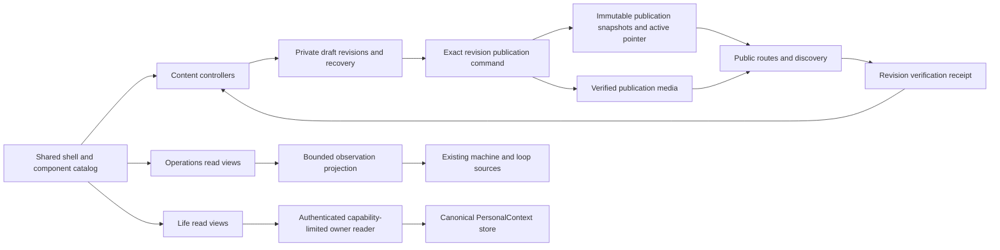

# Admin: a finished personal workspace

The approved amended product, recovery and operating plan is now in implementation.
Use [the Quiet Precision delivery contract](../quiet-precision-delivery.md) for
current authority, dependencies, compatibility and recovery requirements. Every
PR waits for Ani's review. This earlier visual packet retains the eight studies
and annotations; older architecture and automatic release assumptions below are
historical where the amended contract supersedes them.

Design and architecture proposal, September 13, 2026. This document records all
17 production annotations and the intended end state. It is not a deployment
receipt or evidence that a private integration is connected.

Review material: [interactive playground](playground.html) and [eight focused
image studies](visual-index.md). The combined board is superseded. Generated
images contain documented fidelity errors; the approved shell and local component
catalog take precedence. The proposed desktop defaults are split Before/After
diffs and a selected record beside its list, with unified and expanded views
available. Ani expressed a strong preference for Quiet Precision on September 13,
2026; use that preset as the shared visual baseline. Detailed interaction choices
and final rendered acceptance remain open.

## Preferred direction: Quiet Precision

Carry the playground's balanced density, restrained workspace accents, neutral
surfaces, subtle borders and compact controls through Content, Operations and
Life. Preserve Instrument Sans, the approved bracketed wordmark, Phosphor regular
icons and the approved sidebar geometry. Apply the same component treatment in
light and dark appearance. The preset's light preview does not remove dark mode.

Use this direction to refine the shared catalog and page compositions. The other
presets remain comparison tools; they are not competing implementation targets.
The desktop split diff is the current preset default, with unified view available.
Record-detail placement remains a separate interaction decision. This preference
does not establish that fictional records or proposed connections are real.

## The finish line

Ani can maintain his public website through Content, inspect his machines and
loops through Operations, and browse authorized personal knowledge through Life.
Ordinary use does not require GitHub, a terminal, a deployment dashboard, or
continued redesign. New records use existing page patterns rather than adding
new layouts. A service failure states what is unavailable and preserves the last
verified information. Scheduled software/security maintenance still exists; the
goal is low maintenance, not a promise of a system that never needs maintenance.

| Workspace  | Purpose                                                              | Allowed actions                                                                           | Explicit boundary                                                                                 |
| ---------- | -------------------------------------------------------------------- | ----------------------------------------------------------------------------------------- | ------------------------------------------------------------------------------------------------- |
| Content    | Maintain anipotts.com                                                | Edit private drafts, preview, review, publish an exact revision, restore a prior revision | No implicit publication, newsletter send, or cross-workspace data import                          |
| Operations | Know which machines and loops were observed and what needs attention | Read, filter, inspect evidence, refresh                                                   | No start/stop, disconnect, reconnect, archive, or delete controls in this increment               |
| Life       | Read personal knowledge with its source and uncertainty              | Browse, search, open sources, inspect contextual excerpts                                 | No editing, ingestion controls, generated claims written back, or disclosure to Content/telemetry |

## What the current production state means

The latest admin release is `ae2d9570`, PR #342, deployed in run 34772294792.
PR #341 delivered the review refinement at `727203fe`; PR #342 corrected a
production theme startup error found during authenticated QA. Dedicated publishing D1 and private R2 exist; direct publishing has
not been activated. The current publication panel belongs to the legacy Git
publisher. `unreleased_public_changes` means its public-release preflight found
public-impacting repository changes that the public site has not released. It
does not mean that a saved private draft was deleted or that the draft is live.

On September 13, authenticated browser inspection confirmed all four visible
Chainedchat fields, including Description, are saved privately. An ignored private
backup of their visible text and rich HTML is retained. This is not yet a complete
revision/media export. Before changing publishing,
capture that exact draft, revision, base hash and referenced media through the
authenticated editor's supported private export/read path. Store the export only
in ignored private storage. Verify it can be reopened; never reconstruct the
authoritative draft by guessing whitespace or word order from a diff screenshot.
The three annotated fields are Subtitle, Card copy and Description. Preserve all
other fields and media too. Do not retry or cancel an existing publication job
until its actual receipt and effect have been inspected.

Two implementation gaps are architectural: Operations currently lacks an attached
observation capability, and Life's available owner reader exposes fewer methods
than the UI advertises. A polished unavailable screen does not close either gap.

## Visual contract

The approved upper sidebar is the reference. Keep the bracketed wordmark,
Instrument Sans, Phosphor regular icons, neutral document surface, subtle workspace
accent, compact density and stationary icon column. Content is blue, Operations
muted teal, Life violet. Semantic success/warning/failure colors never change
meaning with workspace color. Avoid nested cards, oversized banners, unnecessary
subtitles, decorative counters, animated activity theaters and status explained
only by color.

One component catalog supplies geometry, tokens and interaction behavior. Page
composition can differ; component construction does not. Keep the installed
Astryx version during this redesign. A framework upgrade is a separate change.

### Layouts and responsive behavior

- Desktop expanded: approximately 200px sidebar; 12px top inset; only the main
  surface's upper-left corner rounded. Desktop collapsed: approved 52px rail,
  no top inset, full available main height. Only the inside of the main surface
  scrolls. The inset and sidebar remain stationary.
- Data/review pages use full available panel width with responsive horizontal
  padding, proposed `clamp(20px, 3vw, 48px)` mapped to shared spacing tokens. A
  reading column may remain about 70 characters wide inside that broad frame;
  it must not constrain the toolbar, table or diff.
- Tablet uses the compact rail with expandable navigation. Mobile uses a compact
  header and drawer, omits global search and has at least 44px touch targets.
- Toolbars have one primary action. Review uses Back to editor, Save status,
  Publication status and Publish in a single desktop row. On narrow screens the
  primary action stays within the top toolbar and wraps deliberately; it does
  not move to the bottom of the document.
- Tables share row height, icon column, metadata alignment, hover, keyboard
  behavior, empty/error presentation and overflow rules. Mobile preserves useful
  columns or turns each row into a consistent labeled record; no whole-page
  horizontal scrolling. Code diffs can scroll within their own region.

### Motion, focus and tooltips

Proposed values are interaction targets, not delays in application state:

| Interaction                            | Treatment                                                             |
| -------------------------------------- | --------------------------------------------------------------------- |
| Hover, selected row, tooltip dismissal | Immediate, no intentional debounce or linger                          |
| Menu/palette appearance                | 60–90ms opacity, no large translation/scale, input usable immediately |
| Sidebar/layout change                  | 100–125ms coordinated width/inset, fixed icon baseline                |
| Reduced motion                         | Immediate state changes; no pulse or progress choreography            |
| Data/save/publish status               | Changes only when evidence arrives; never a timer-generated success   |

The installed Astryx defaults include 410ms medium motion. Override shared motion
tokens once rather than scattering animation overrides across components. Audit
portal surfaces too. Keep performance work separate from network latency: local
navigation search renders immediately; remote search can debounce request volume
without delaying the user's typing or UI feedback. Cancel obsolete requests.

Use a restrained, consistent keyboard-only focus outline. Do not remove focus
visibility. Labeled controls such as Publish and Back to editor need no redundant
tooltip. Icon-only ambiguous controls retain accessible names and concise
tooltips. Theme options use the same square targets and selected treatment as
sidebar controls; retain accessible Light/Dark/System names. Workspace menu width
is at least its trigger and its longest item, bounded by the viewport. Active and
hover treatments must not overflow the menu or depend on browser default rings.

## Every page

### Content

| Page       | Main surface                                                                             | Useful action/details                                             |
| ---------- | ---------------------------------------------------------------------------------------- | ----------------------------------------------------------------- |
| Overview   | Recent records with exact title and relative edit time; compact unpublished-changes list | Resume an exact record; no decorative analytics                   |
| Writing    | Consistent rows: title, draft/publication state, changed time                            | Search/filter/sort; default recent changes, stable ID tie-breaker |
| Pages      | Same library rows for fixed website pages                                                | Open editor; source-backed field definitions                      |
| Projects   | Same rows and state language                                                             | Open project editor; preserve authored capitalization             |
| Newsletter | Existing issue drafts and supported review capabilities                                  | No implied send or unsupported public preview                     |
| Editor     | Broad frame with readable body; consistent properties inspector                          | Private autosave, images, restore/history; Review primary action  |
| Review     | Field-grouped conventional diffs                                                         | Publish in top toolbar; compare exact reviewed revision           |
| Preview    | Exact saved revision and real public rendering                                           | Return to editor/review without losing state                      |
| History    | Immutable revisions and relative/absolute time                                           | Compare; restoring creates a new draft, never silently publishes  |

Diffs default to split Before/After on wide desktops and unified minus/plus rows
on narrow screens. Field labels are stable section headings. Whole-line or
paragraph backgrounds establish old/new context; changed tokens may be lightly
emphasized inside each side. Never interleave struck-out and inserted prose into
one unreadable sentence. Use line numbers for line-oriented source, not invented
line numbers for unrelated metadata fields. Rich formatting, links and media
changes remain inspectable. Offer rendered/source comparison without hiding
meaningful non-text changes. Preserve whitespace and escape source text.

### Save and publication are separate models

`SaveStatus` is a reusable presentational component over the existing autosave
state, built with Astryx Token/StatusDot and visible text (Badge remains a count
primitive). It cannot declare a write successful itself.

| Save state              | User-facing meaning                                   | Behavior                                        |
| ----------------------- | ----------------------------------------------------- | ----------------------------------------------- |
| Changed                 | Latest typing has not been acknowledged               | Keep durable recovery and revision identity     |
| Saving                  | Request in flight                                     | No text/toolbar size jump                       |
| Saved                   | Exact current draft acknowledged                      | Time/details available without repetitive toast |
| Saved locally / Offline | Local recovery exists; remote persistence unconfirmed | Do not call this Saved privately on the server  |
| Save failed             | A save attempt failed                                 | Retry plus preserved text                       |
| Conflict                | Server revision changed                               | Compare/recover; never silently overwrite       |
| Session expired         | Owner authentication is needed                        | Preserve text; reauthenticate and resume        |

Publication uses a durable operation ID, exact draft revision and content/media
digest. Proposed concise primary states are Not live, Publishing, Verifying,
Live, Failed and Verification unavailable. Details explain the last observed
effect, time and actionable reason. After a verified success show `Live` and
`View live`; new edits immediately become `Unpublished changes` while the prior
live revision remains identifiable. A failed verification after activation must
say that activation occurred but public verification is incomplete. A timeout is
not a failure proof and not a success proof.

Remove the always-visible Prepare/Checks/Deploy/Live stepper. Details disclose
actual operation events when needed. Display retry only for retryable operations;
reuse the same idempotency key. Do not offer Stop when cancellation cannot undo
an already committed public effect. Failed/blocking reasons use plain copy, such
as `Not published. The public site needs an update first.` with technical details
available separately. Never hide a persistent failure in a toast.

### Operations

Only Machines and Loops are top-level destinations. The page title matches the
selected destination; do not repeat those destinations as tabs inside each page.

Machines: recognizable laptop/desktop icons, configured friendly name, last
observation state and timestamp. Selecting a row opens a detail pane containing
the observed service summary, last successful contact, latest read result and
bounded evidence. 1Password Connect health and sync activity are different facts;
show unknown activity when only health is known. No fake Connected state.

Loops: name/purpose, latest observed run, result and time. Selecting a row shows
run history with evidence and actual duration only when measured. Expected schedule
is separate from observed execution. No elapsed clock fabricated from historical
checkpoints. Advanced diagnostics live inside details, not another primary menu.

Prefer fetch-on-open, explicit Refresh and conditional background refresh only
while visible. A sensible starting cadence is 60s for a visible overview, with
backoff, visibility suspension and last-checked time. This is a scheduling policy,
not a simulated stream. WebSockets are optional transport, not a UI requirement.
On read failure retain previous observations and mark their age; never turn all
machines into Disconnected because the dashboard failed to fetch.

### Life

Recommended stable destinations: Recent, People, Projects, Knowledge, Places,
Timeline and Sources. Knowledge requires an explicit read projection before it
becomes a primary production destination. The existing Overview URL can remain
as the Recent landing page. Topic
views such as Health, Aesthetics or Knowledge are scoped saved views once the
authorized reader supports their source boundary; avoid empty primary pages.

| Page          | Main surface                                                  | Context access                                                    |
| ------------- | ------------------------------------------------------------- | ----------------------------------------------------------------- |
| Recent        | Recently updated authorized records, title/type/source/date   | Open record with evidence summary                                 |
| People        | Searchable entity rows with only permitted identifying fields | Person facts, dated evidence and related records                  |
| Projects      | Project entities with status only when source-supported       | Goals/events/decisions with provenance                            |
| Knowledge     | Source-linked topic and synthesis pages                       | Backlinks, dated disagreements, evidence and context              |
| Places        | Named locations and dated associations                        | Source-backed visits/relationships, no inferred precise tracking  |
| Timeline      | Observed events, grouped by date                              | Distinguish event time, source time, capture time and uncertainty |
| Sources       | Source inventory, boundaries and last successful read         | Read-only source details and originating record links             |
| Record detail | Summary, facts, evidence and corrections                      | Context view scoped to this record/category, including exclusions |

Remove standalone Context preview from primary navigation. A context pane belongs
inside the category/record being read. It shows which facts and excerpts a read
would include, source/date citations and uncertainty. Do not invent a token meter,
confidence percentage, or generated authoritative biography. Copy/export of
private context is a separate explicit disclosure action, not automatic on hover.

## Architecture that supports this UI

The shared layer owns presentation, navigation and safe request lifecycle, not
shared storage or shared authorization. Keep Content drafts, publication storage,
Operations metadata and Life records separate. No universal endpoint returning
all three workspaces. No private query history in persistent browser storage.

Use a typed route/capability registry to generate sidebar, breadcrumbs and palette
destinations, replacing competing navigation arrays. Visible pages must correspond
to real supported reads. Legacy URLs redirect or open a compatible details view;
they must not duplicate navigation or destroy bookmarked state.

Publication invariant: exactly one active publishing mode. The current draft-store
alarm still initializes the legacy Git publisher independently of direct mode.
Before activation, inventory/reconcile pending legacy operations and preserve
receipts; enabling D1 must not leave old alarms able to publish a competing Git
version later. Use an explicit reviewed mode transition, not two unrelated flags.
Do not cancel or delete historical jobs without understanding their effects.

Direct publication stores immutable payloads and an atomic active pointer, then
independently verifies the public revision and discovery inventory version.
Media must be verified before activation. Use a small versioned public manifest
and conditional reads rather than loading every published body on every request.
Introduce caching only with invalidation and consistency tests; public routes,
search, feed, sitemap and project/writing listings read the same published version.
Rollback selects a prior valid revision and verifies it; it is separate from
rolling back the app deployment.

Life retains one canonical writer outside admin. Admin reads only approved source
sets through status/search/get/source capabilities. Entity/timeline views either
use explicit supported queries/projections or remain clearly unavailable. Derived
knowledge is rebuildable and preserves source revision pointers and corrections.
Do not replace canonical storage because a new knowledge-management fashion is
popular. The browser boundary still needs host, owner identity, allowed operations,
session expiry, revocation and denial proof before returning sensitive records.

Keep `fetchedAt`, `sourceObservedAt`, `effectiveAt` and `revision` distinct. The
current Life adapter assigns `observedAt` at read completion, which cannot prove
when the source was observed. Capability metadata declares supported methods,
source grants and pagination, but the server independently enforces access.

The editor must recover a retained draft even if Git or the public base is
unavailable. The current record read joins base, draft and history with
`Promise.all`; split independent recovery from comparison readiness. Render the
saved draft and say Website comparison unavailable; only dependent review and
publish actions should be blocked.

The old publication stages derive from stored jobs, not fake timer progression.
Their presentation is still too slow and opaque: the first observation waits
four seconds, in-flight requests are not aborted by the cancellation flag, and
there is no visible observation time. Replace this with an immediate observation
and bounded, visibility-aware refresh, not a faster simulated progress sequence.

Operations currently calls another fetch Reconnect and schedules successful reads
every second. Rename the action Refresh/Try again according to effect, centralize
visible-page scheduling, and model entity type and machine association explicitly
rather than classifying rows through hardcoded ID lists.

## Research grounding

Checked September 13, 2026. These are specific primary-source patterns, not a
claim of universal consensus or a named engineer's endorsement of this design.
The personal X account could not be inspected with the tools available in this
turn. Public primary sources were used instead; no private feed was read.

- Karpathy's April 4, 2026 [LLM Wiki](https://gist.github.com/karpathy/442a6bf555914893e9891c11519de94f)
  distinguishes original sources, derived linked knowledge and maintenance
  conventions. This supports a readable source-backed projection, including
  contradictions and a change log. His own workflow involves curation; it does
  not establish that unattended ingestion or one universal taxonomy is best.
- [QMD](https://github.com/tobi/qmd) is a current example of local document search
  with collection context and bounded retrieval. Borrow those interaction ideas;
  adding another index/store is not required for this admin.
- The [1Password Connect API](https://www.1password.dev/connect/api-reference)
  separates heartbeat, health and activity. UI labels must preserve that
  distinction; a healthy endpoint cannot prove active synchronization.
- Installed Astryx 0.4.6 supplies 158 components, including Citation, MetadataList,
  Timestamp, TreeList and CommandPalette. Local CLI motion documentation explicitly
  discourages lag on frequent hover/list interactions and interaction-blocking
  animations. Tune its tokens rather than replace the component library.

## Shared components to build or consolidate

| App abstraction                   | Installed Astryx foundation                                 | Responsibility                                                    |
| --------------------------------- | ----------------------------------------------------------- | ----------------------------------------------------------------- |
| WorkspacePage / PageToolbar       | Layout, Toolbar, HStack, VStack, OverflowList               | Width, padding, sticky actions, responsive containment            |
| RecordTable / RecordRow           | Table, List, Item, Pagination                               | Consistent alignment/density/selection, capability-aware paging   |
| SaveStatus / PublicationStatus    | Token, StatusDot, Timestamp, Popover                        | Distinct truthful state and optional details                      |
| EvidenceDetails / SourceReference | MetadataList, Citation, Timestamp, Collapsible              | Provenance, dates, uncertainty and bounded source drill-down      |
| ContextPane                       | LayoutPanel, Markdown, Outline                              | Per-category/record read context, not an extra global destination |
| ReviewDiff                        | Semantic rows and a tested diff model inside Astryx layouts | Unified/split, exact text, rich metadata and media changes        |
| WorkspaceCommandPalette           | CommandPalette family, Typeahead, Kbd                       | Fixed geometry, local-first results, cancelable private reads     |
| ReadState                         | EmptyState, Banner, Skeleton, Button                        | Loading, empty, unavailable, stale, denied and retry patterns     |

Citation, MetadataList, Timestamp, Outline and TreeList are already installed;
use them where their semantics help. A source hierarchy can use TreeList, but a
record list need not become a tree. Agent-native here means provenance, bounded
context, auditable effects and recoverable operations. ChatComposer/ChatToolCalls
are not reasons to add a chatbot or an animated agent feed to this admin.

Separate controllers/adapters from reusable views. Consolidate request deduplication,
abort/cleanup, current revision guards and bounded errors where semantics match.
Do not collapse different authorization or retry rules into one generic fetcher.
Measure typing responsiveness, open-to-focus latency, request counts, polling when
hidden, query plans and route bundle size before optimizing. Suggested acceptance
budgets: local typing and palette response p95 under 100ms on Ani's laptop; no
intentional open delay; no duplicate mutation for a double click; no polling from
hidden/unmounted views. These are targets to measure, not current results.

## Annotation ledger

| Comment | Requirement                             | Implementation target            | Acceptance                                                        |
| ------- | --------------------------------------- | -------------------------------- | ----------------------------------------------------------------- |
| 1       | Conventional IDE diffs                  | ReviewDiff                       | Unified/split old/new rows, whitespace/rich/media correctness     |
| 2       | Full desktop width, responsive padding  | WorkspacePage                    | 640/834/1384/1920 widths; no narrow review container              |
| 3       | Publish beside Back to editor           | PageToolbar                      | Single top action row, deliberate mobile wrap                     |
| 4       | Reusable real-time save badge           | SaveStatus                       | Every real autosave state, no jitter, no premature success        |
| 5       | Consistent theme/logout rail            | Shared sidebar controls          | Same targets, icon sizes, focus and selected treatment            |
| 6       | Remove obvious tooltips                 | Tooltip policy                   | No redundant labeled-button hints; icon-only accessibility kept   |
| 7       | Complete post-publish flow              | Publication controller/status    | Exact revision, reload/retry/conflict/verified-live states        |
| 8       | Simple understandable publication       | Compact status/details           | Clear outcome and reason; pipeline hidden by default              |
| 9       | Faster global motion                    | Theme motion tokens              | No intentional hover lag; measured palette focus, reduced motion  |
| 10      | Complete palette/catalog design         | Playground + shared catalog      | Fixed shell/input, consistent rows, real keyboard interactions    |
| 11      | Truthful publication status             | Evidence-based publication model | No fake timings; activation vs verification distinguished         |
| 12      | Preserve chainedchat edits              | Private draft recovery/export    | Exact latest revision restored from verified private copy         |
| 13      | Fix menu/focus/geometry inconsistencies | Shared menu/control tokens       | Longest item fits, contained rows, subtle visible keyboard focus  |
| 14      | Useful simple Machines                  | Operations read views            | No duplicate Loops tabs; recognizable real machines/evidence      |
| 15      | Useful simple Loops                     | Operations read views            | Observed run outcomes, no fake stream, no write controls          |
| 16      | Conventional source-aware Life          | Life read architecture + views   | Authorized real reads with sources/dates/corrections              |
| 17      | Context inside each category            | ContextPane                      | No global Context preview destination; scoped contextual evidence |

## Execution and approval sequence

1. **Preservation and baseline.** Export/verify chainedchat's exact private revision.
   Released editor navigation, newsletter preview, and logout fixes were reconciled
   into the canonical integration baseline before this refinement. The new review
   UI is isolated in PR341; publishing work and all private records remain in their
   existing checkout. Preserve branches and unfinished work.
2. **Visual refinement.** Quiet Precision is the preferred visual direction.
   Carry its balanced density and restrained treatment into the shared catalog;
   resolve detailed record placement, diff and palette behavior through the
   playground and rendered review. Images and fixtures are not live integration
   proof.
3. **Shared UI increment.** Implement the approved catalog, motion/focus rules,
   review toolbar/diff/status and workspace route consistency. Test and deploy an
   admin-only increment; no unreviewed dependency migration or public changes.
4. **Direct Content completion.** Prove isolated storage, media, exact revision,
   one-publisher transition, transfer and public verification; release scoped
   www/admin changes. Inspect real pending jobs before any reserved cancellation.
   Do not publish Ani's drafts as tests. Use isolated fixtures or an explicitly
   approved public test target for production write acceptance.
5. **Operations read acceptance.** Connect the smallest approved metadata source,
   then validate machine/loop facts and stale/error handling. No controls for
   altering machines or services. Missing sources remain unknown.
6. **Life read acceptance.** Establish the specific approved owner route and source
   allowlist, prove denial/session boundaries, then enable supported category
   reads. No browser editing of canonical PersonalContext.
7. **Final acceptance and maintenance.** Review every route/state at desktop,
   tablet/mobile, light/dark/system, keyboard, touch and reduced motion. Verify
   draft recovery under slow saves, offline, expired auth, competing revisions,
   popup failure and retry. Record exact PR/SHA/target/deploy/live receipts and
   rollback evidence. Remove redundant code/worktrees only after parity and
   preservation checks. Keep security/runtime maintenance independent of content.

## Completion criteria

The project is complete only when Content works end to end with verified public
results, Operations shows actual authorized observations, Life returns actual
authorized records, every primary destination has a useful supported state, and
Ani approves the selected visual system at representative widths. A full set of
screenshots, passing builds, connected storage or HTTP 200 alone is insufficient.
If access or provider changes require Ani, present one narrow concrete decision
through the question tool; never request broad secrets or account access in chat.

## September 13 review refinement checkpoint

PR341 contains conventional review diffs, the shared truthful save token, the
Review changes page title and compact toolbar, responsive touch targets, and the
complementary 768px navigation boundary. Its UI release retains the legacy
publisher; direct publishing and bindings are separate. Both exact-head CI and admin-only deployment passed. Authenticated production
checks confirmed the layout, preserved private draft, comparison modes, tablet/phone
touch targets and theme startup. Other deployment targets were skipped.

Canonical-only transfer validation now requires matching record, operation,
production revision and source hash before acknowledging local publication.
A receipt proves activation, not independent public rendering. One Publish action
uses the authenticated bridge; optional draft-only continuation lives in the
Document actions menu. Production still requires deployed transfer/direct code,
resource bindings, one active publisher mode, recovery acceptance and public
render/discovery verification before this flow can be called live.

Field-level Edit and full-screen expansion are specified in
[the editable review proposal](../quiet-precision-review-2026-09-13.md). They
remain a separate implementation after this UI increment; autosave never silently
approves edits made from a review.
